<div align="center">


[](https://github.com/AlishaVashishth)

<br/>



<br/><br/>

[](https://www.linkedin.com/in/alishavashishth)
[](https://leetcode.com/u/AlishaVashishth/)
[](https://github.com/AlishaVashishth)

</div>

---

## 🧭 about_me

```bash
alisha@github:~$ cat about.md

  ROLE      Full-stack developer building AI-powered products
  SHIPS     RAG chatbots · hybrid recommenders · vision models
  DOMAINS   Fintech · campus tech · HR analytics
  APPROACH  Model, API and UI built together, not handed off
  PRACTICE  DSA on LeetCode to keep fundamentals sharp
  OPEN TO   Internships · collaborations · hard problems

alisha@github:~$ _
```

---

## 🛠 tech_stack

**Languages**


**Web & APIs**


**AI / ML**


**Systems & Tools**


**Core CS**

`Data Structures & Algorithms` · `Operating Systems` · `Computer Networks` · `DBMS` · `OOP` · `Concurrency` · `REST APIs`

**Certifications**


---

## 📊 github_stats

<div align="center">


</div>

---

## 📈 activity

<div align="center">


</div>

---

<div align="center">


</div>

```bash
$ echo "thanks for stopping by — let's build something."
thanks for stopping by — let's build something.
$ _
```

<div align="center">


</div>
